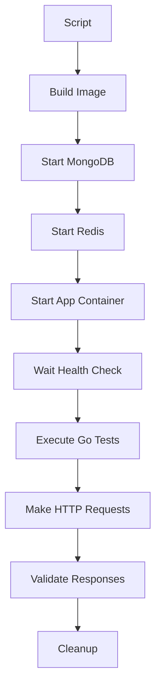

# Integration Test - Docker Image

This documentation explains how to run integration tests **against a Docker image** of the application running in a container, simulating a real production environment.

## 🎯 **Approach Differences**

| Aspect | Internal Test (`integration_test.go`) | Image Test (`integration_image_test.go`) |
|---------|---------------------------------------|-----------------------------------------------|
| **Execution** | Within the same process | External HTTP to container |
| **Realism** | Integrated unit test | Real end-to-end test |
| **Isolation** | Same memory environment | Isolated container |
| **Performance** | Faster | Slower (HTTP network) |
| **Debugging** | Direct code access | Container logs |

## 🚀 **How to Run**

### **Option 1: Automated Script (Recommended)**
```bash
# Run all tests
./run_image_tests.sh

# With forced rebuild
./run_image_tests.sh --build

# Verbose mode
./run_image_tests.sh --verbose

# Specific test
./run_image_tests.sh --test TestCreateAndExecuteCode

# Keep containers for debug
./run_image_tests.sh --no-cleanup --logs
```

### **Option 2: Docker Compose**
```bash
# Start application
docker compose -f docker-compose.image-test.yml up -d

# Run tests (in another terminal)
export CODEACTIONS_BASE_URL="http://localhost:8050"
go test -v ./integration_image_test.go

# Stop services
docker compose -f docker-compose.image-test.yml down
```

### **Option 3: Manual**
```bash
# 1. Build image
docker build -t codeactions-app .

docker network create app_test

# 2. Start dependencies
docker run -d --name mongo_test --network app_test -p 27017:27017 mongo:7

docker run -d --name redis_test --network app_test -p 6379:6379 redis:7-alpine

# 3. Start application
docker run -d --name app-test --network app_test -p 8050:8050 \
  -e FLOWS_CODE_ACTIONS_MONGO_DB_URI="mongodb://mongo_test:27017" \
  -e FLOWS_CODE_ACTIONS_MONGO_DB_NAME="codeactions_test" \
  -e FLOWS_CODE_ACTIONS_REDIS="redis://redis_test:6379/1" \
  -e FLOWS_CODE_ACTIONS_ENVIRONMENT="test" \
  codeactions-app

# 4. Run tests
go test -v ./integration_image_test.go

docker stop mongo_test redis_test app-test
docker rm mongo_test redis_test app-test
```

## 📋 **Implemented Tests**

### 1. **TestHealthEndpoint**
- Verifies if application is responding
- Validates basic health endpoint

### 2. **TestCreateAndExecuteCode**
- Creates Python code via API
- Executes code via public endpoint
- Validates execution result

### 3. **TestCreateCodeWithComplexLogic**
- Tests code with libraries (json, datetime)
- Mathematical operations and strings
- Detailed result verification

### 4. **TestListCodes**
- Tests listing endpoint
- Validates response structure

### 5. **TestCodeWithParameters**
- Code that receives HTTP parameters
- Tests JSON payload passing

### 6. **TestErrorHandling**
- Code with intentional error
- Verifies exception handling

## ⚙️ **Configuration**

### **Environment Variables**
```bash
CODEACTIONS_BASE_URL=http://localhost:8050  # Application URL
```

### **Dependencies**
- **Docker** and **Docker Compose**
- **Go 1.21+** to run tests
- **curl** (optional, for health checks)

## 🔧 **Available Scripts**

### **`run_image_tests.sh`**
Main script that:
1. ✅ Checks if image exists, otherwise builds
2. 🐳 Starts MongoDB and Redis
3. 🚀 Runs application in container
4. 🧪 Executes external HTTP tests
5. 🧹 Cleans environment (optional)

**Options:**
```bash
--build, -b         # Force image rebuild
--verbose, -v       # Detailed test output
--test, -t <name>   # Run specific test
--no-cleanup        # Keep containers running
--logs, -l          # Show service logs
--port, -p <port>   # Custom port (default: 8050)
```

## 🔍 **How It Works**



## 📊 **Execution Example**

```bash
$ ./run_image_tests.sh --verbose

🐳 Integration Test - Docker Image
======================================
✅ Docker is working
🧹 Cleaning containers and network...
✅ Cleanup completed
✅ codeactions-app image already exists
📦 Starting dependencies (MongoDB and Redis)...
⏳ Waiting for dependencies to become ready...
✅ MongoDB ready
✅ Redis ready
🚀 Starting application...
⏳ Waiting for application to become available...
✅ Application available at http://localhost:8050
🧪 Running integration tests...
🔍 Verbose mode activated

=== RUN   TestImageIntegrationSuite
=== RUN   TestImageIntegrationSuite/TestHealthEndpoint
✅ Application available at http://localhost:8050
Health response: {"status":"ok"}
=== RUN   TestImageIntegrationSuite/TestCreateAndExecuteCode
✅ Code created with ID: 507f1f77bcf86cd799439011
✅ Code executed successfully: map[calculation:50 message:Integration test success!]
=== RUN   TestImageIntegrationSuite/TestCreateCodeWithComplexLogic
✅ Complex code executed: timestamp=2024-01-15T10:30:00.123Z
=== RUN   TestImageIntegrationSuite/TestListCodes
✅ Listing returned 2 codes
=== RUN   TestImageIntegrationSuite/TestCodeWithParameters
✅ Test with parameters executed
=== RUN   TestImageIntegrationSuite/TestErrorHandling
✅ Error handling tested (status: 500)
--- PASS: TestImageIntegrationSuite (15.23s)
PASS
🎉 All tests passed!
```

## 🔍 **Debug and Troubleshooting**

### **View application logs:**
```bash
docker logs codeactions-app-test --tail 50
```

### **Test manually:**
```bash
# Health check
curl http://localhost:8050/health

# Create code
curl -X POST "http://localhost:8050/code?project_uuid=test&name=test&type=endpoint&language=python" \
  -d 'def Run(engine): engine.result.set({"test": "ok"}, content_type="json")'

# Execute code
curl -X POST http://localhost:8050/action/endpoint/CODE_ID
```

### **Containers don't start:**
```bash
# Check logs
docker logs mongo-test
docker logs redis-test
docker logs codeactions-app-test

# Check network
docker network ls
docker network inspect codeactions-test-network
```

## 💡 **Advantages of This Approach**

1. **🎯 Maximum Realism** - Tests how real client would use it
2. **🔒 Complete Isolation** - Separate container for application
3. **🚀 Deploy Testing** - Validates that Docker image works
4. **🌐 Network Testing** - Validates real HTTP communication
5. **🔧 Simplified Debug** - Separate logs per service
6. **📈 High Confidence** - If it passes here, it will work in production

## 🆚 **When to Use Each Approach**

| Scenario | Recommended Approach |
|---------|----------------------|
| Rapid development | `integration_test.go` |
| CI/CD Pipeline | `integration_image_test.go` |
| Deploy testing | `integration_image_test.go` |
| Code debugging | `integration_test.go` |
| Production validation | `integration_image_test.go` |
| Performance testing | `integration_image_test.go` |

This approach ensures your application will work exactly as in production! 🚀
