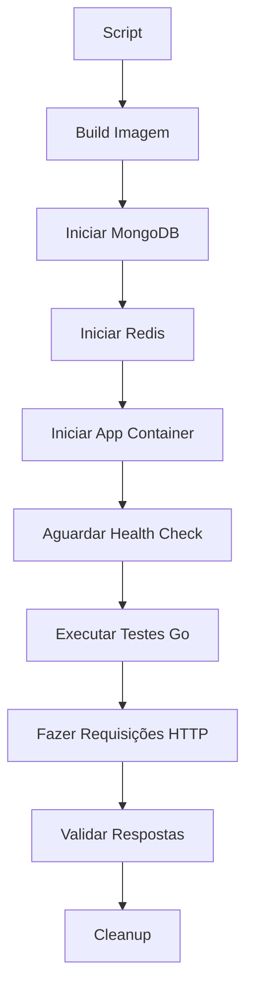

# Teste de Integração - Imagem Docker

Esta documentação explica como executar testes de integração **contra uma imagem Docker** da aplicação rodando em container, simulando um ambiente de produção real.

## 🎯 **Diferenças das Abordagens**

| Aspecto | Teste Interno (`integration_test.go`) | Teste de Imagem (`integration_image_test.go`) |
|---------|---------------------------------------|-----------------------------------------------|
| **Execução** | Dentro do mesmo processo | HTTP externo para container |
| **Realismo** | Teste de unidade integrada | Teste end-to-end real |
| **Isolamento** | Mesmo ambiente de memória | Container isolado |
| **Performance** | Mais rápido | Mais lento (rede HTTP) |
| **Debugging** | Acesso direto ao código | Logs do container |

## 🚀 **Como Executar**

### **Opção 1: Script Automatizado (Recomendado)**
```bash
# Executar todos os testes
./run_image_tests.sh

# Com rebuild forçado
./run_image_tests.sh --build

# Modo verboso
./run_image_tests.sh --verbose

# Teste específico
./run_image_tests.sh --test TestCreateAndExecuteCode

# Manter containers para debug
./run_image_tests.sh --no-cleanup --logs
```

### **Opção 2: Docker Compose**
```bash
# Iniciar aplicação
docker compose -f docker-compose.image-test.yml up -d

# Executar testes (em outro terminal)
export CODEACTIONS_BASE_URL="http://localhost:8050"
go test -v ./integration_image_test.go

# Parar serviços
docker compose -f docker-compose.image-test.yml down
```

### **Opção 3: Manual**
```bash
# 1. Build da imagem
docker build -t codeactions-app .

docker network create app_test

# 2. Iniciar dependências
docker run -d --name mongo_test --network app_test -p 27017:27017 mongo:7

docker run -d --name redis_test --network app_test -p 6379:6379 redis:7-alpine

# 3. Iniciar aplicação
docker run -d --name app-test --network app_test -p 8050:8050 \
  -e FLOWS_CODE_ACTIONS_MONGO_DB_URI="mongodb://mongo_test:27017" \
  -e FLOWS_CODE_ACTIONS_MONGO_DB_NAME="codeactions_test" \
  -e FLOWS_CODE_ACTIONS_REDIS="redis://redis_test:6379/1" \
  -e FLOWS_CODE_ACTIONS_ENVIRONMENT="test" \
  codeactions-app

# 4. Executar testes
go test -v ./integration_image_test.go


docker stop mongo_test redis_test app-test
docker rm mongo_test redis_test app-test
```

## 📋 **Testes Implementados**

### 1. **TestHealthEndpoint**
- Verifica se aplicação está respondendo
- Valida endpoint básico de saúde

### 2. **TestCreateAndExecuteCode**
- Cria código Python via API
- Executa código via endpoint público
- Valida resultado da execução

### 3. **TestCreateCodeWithComplexLogic**
- Testa código com bibliotecas (json, datetime)
- Operações matemáticas e strings
- Verificações detalhadas de resultado

### 4. **TestListCodes**
- Testa endpoint de listagem
- Valida estrutura de resposta

### 5. **TestCodeWithParameters**
- Código que recebe parâmetros HTTP
- Testa passagem de payload JSON

### 6. **TestErrorHandling**
- Código com erro intencional
- Verifica tratamento de exceções

## ⚙️ **Configuração**

### **Variáveis de Ambiente**
```bash
CODEACTIONS_BASE_URL=http://localhost:8050  # URL da aplicação
```

### **Dependências**
- **Docker** e **Docker Compose**
- **Go 1.21+** para executar os testes
- **curl** (opcional, para health checks)

## 🔧 **Scripts Disponíveis**

### **`run_image_tests.sh`**
Script principal que:
1. ✅ Verifica se imagem existe, senão builda
2. 🐳 Inicia MongoDB e Redis
3. 🚀 Roda aplicação em container
4. 🧪 Executa testes HTTP externos
5. 🧹 Limpa ambiente (opcional)

**Opções:**
```bash
--build, -b         # Forçar rebuild da imagem
--verbose, -v       # Saída detalhada dos testes
--test, -t <nome>   # Executar teste específico
--no-cleanup        # Manter containers rodando
--logs, -l          # Mostrar logs dos serviços
--port, -p <porta>  # Porta customizada (padrão: 8050)
```

## 🔍 **Como Funciona**



## 📊 **Exemplo de Execução**

```bash
$ ./run_image_tests.sh --verbose

🐳 Teste de Integração - Imagem Docker
======================================
✅ Docker está funcionando
🧹 Limpando containers e rede...
✅ Limpeza concluída
✅ Imagem codeactions-app já existe
📦 Iniciando dependências (MongoDB e Redis)...
⏳ Aguardando dependências ficarem prontas...
✅ MongoDB pronto
✅ Redis pronto
🚀 Iniciando aplicação...
⏳ Aguardando aplicação ficar disponível...
✅ Aplicação disponível em http://localhost:8050
🧪 Executando testes de integração...
🔍 Modo verboso ativado

=== RUN   TestImageIntegrationSuite
=== RUN   TestImageIntegrationSuite/TestHealthEndpoint
✅ Aplicação disponível em http://localhost:8050
Health response: {"status":"ok"}
=== RUN   TestImageIntegrationSuite/TestCreateAndExecuteCode
✅ Código criado com ID: 507f1f77bcf86cd799439011
✅ Código executado com sucesso: map[calculation:50 message:Integration test success!]
=== RUN   TestImageIntegrationSuite/TestCreateCodeWithComplexLogic
✅ Código complexo executado: timestamp=2024-01-15T10:30:00.123Z
=== RUN   TestImageIntegrationSuite/TestListCodes
✅ Listagem retornou 2 códigos
=== RUN   TestImageIntegrationSuite/TestCodeWithParameters
✅ Teste com parâmetros executado
=== RUN   TestImageIntegrationSuite/TestErrorHandling
✅ Tratamento de erro testado (status: 500)
--- PASS: TestImageIntegrationSuite (15.23s)
PASS
🎉 Todos os testes passaram!
```

## 🔍 **Debug e Troubleshooting**

### **Ver logs da aplicação:**
```bash
docker logs codeactions-app-test --tail 50
```

### **Testar manualmente:**
```bash
# Health check
curl http://localhost:8050/health

# Criar código
curl -X POST "http://localhost:8050/code?project_uuid=test&name=test&type=endpoint&language=python" \
  -d 'def Run(engine): engine.result.set({"test": "ok"}, content_type="json")'

# Executar código
curl -X POST http://localhost:8050/action/endpoint/CODE_ID
```

### **Containers não iniciam:**
```bash
# Verificar logs
docker logs mongo-test
docker logs redis-test
docker logs codeactions-app-test

# Verificar rede
docker network ls
docker network inspect codeactions-test-network
```

## 💡 **Vantagens desta Abordagem**

1. **🎯 Realismo Máximo** - Testa como cliente real usaria
2. **🔒 Isolamento Completo** - Container separado para aplicação
3. **🚀 Teste de Deploy** - Valida que imagem Docker funciona
4. **🌐 Teste de Rede** - Valida comunicação HTTP real
5. **🔧 Debug Facilitado** - Logs separados por serviço
6. **📈 Confiança Alta** - Se passa aqui, vai funcionar em produção

## 🆚 **Quando Usar Cada Abordagem**

| Cenário | Abordagem Recomendada |
|---------|----------------------|
| Desenvolvimento rápido | `integration_test.go` |
| CI/CD Pipeline | `integration_image_test.go` |
| Teste de deploy | `integration_image_test.go` |
| Debug de código | `integration_test.go` |
| Validação de produção | `integration_image_test.go` |
| Teste de performance | `integration_image_test.go` |

Esta abordagem garante que sua aplicação funcionará exatamente como em produção! 🚀 