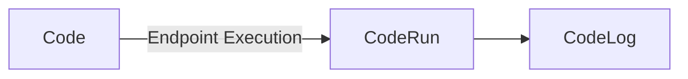

# Flows Code Actions

Flows Code Actions is a tool designed to simplify and provide codes to run as endpoints actions. This application allows anyone to define specific code that will serve as endpoints for many applications solutions and features.




## Code Template

To define executable code using Code Actions, we need to follow a pattern where we must define a function called Run that will have as a parameter the engine that will bring the entire context of the code actions and their main attributes to the code.

Example code:

```python
def Run(engine):
  # your code must be here
  ...
```

Complete code example:

```python

import requests
import json

def Run(engine):
    for key, value in engine.params.items(): # iterates over query string parameters
        print(f"key: {key}, value: {value}")
        
    user_id = engine.params.get("user_id") # to get user_id query string param: engine.params.get("<param_key>")
    user = get_user(user_id)

    if user:
        engine.result.set(user, conten_type="json")
        return # return to finish action execution
    
    engine.result.set({"message": "user not found."}, content_type="json")

def get_user(user_id):

  url = f"https://jsonplaceholder.typicode.com/users/{user_id}"
  response = requests.get(url)

  if response.status_code == 200:
    return response.text
  else:
    return None

```

### Engine

Through the engine we can access the main attributes and definitions of requests such as `params`, `Body`, `Log` e `Result`.

### body

The `body` of the engine refers to the body of the request made for the code action, it comes in string form, and if it is a string in json format you can easily transform it into a dictionary.

Example:

```python
payload = json.loads(engine.body)
payload['some_attr']
```

### params

The `params` will contain the query parameters of the request, if your request has the `cake` parameter you can get this value through the `get(<PARAMETER NAME>)` method.

Example:

```python
mycake = engine.params.get('cake')
```

In addition to get, you can iterate over the params values ​​using `item()`.

Example:
```python
for item in engine.params.items():
  current_item = item
```

### log

`log` is a resource of the `engine` through which you can generate logs at the moment it is called, passing values ​​that can help you debug your code. The types of logs can be `info`, `debug`, `error`. This division between these types is only for organizational reasons and the type of debugging you want to perform and to facilitate filtering.

Example:
```python
engine.log.debug('sleep started')
time.sleep(3)
engine.log.debug('sleep finished')

```

### result

With result, we define the return of the request for the code action, the supported return content-type types are: text, json and html. If not defined, the default will be text.

Exemplos:

returning json:
```python
engine.result(payload, content_type='json')
```

returning text:
```python
engine.result('ok')
# or
engine.result('ok', content_type='text')
```

returning html:
```python
engine.result(payload, content_type='html')
```


## API

Through the API it is possible to create, edit, view and delete Code Actions and consult Code Runs and Code Logs.

### Authorization

You will need an access token for your account at https://dash.weni.ai. With this token, you will be able to perform the main operations of the Code Actions API according to your permission in the projects associated with the actions.

It must be passed in the header as `Authorization: <TOKEN>` or `Authorization: Bearer <TOKEN>`.

### Code

Resource URL: 

https://code-actions.weni.ai/code

#### GET

To see code details, attibutes and source

##### Path Parameters:

CODE_ID

#### POST

The post method is for create a code action.

##### Query String Parameters:

parameter | description 
--- | --- 
name | the name of the code action
language | the language of the code action (python, javascript or go)
type | the type of code action (endpoint or flow)
project_uuid | the project uuid related to the code action

##### Request body:

the source code of the code action as a string.

##### Response body:

```json
{
    "id": "<CODE ID>",
    "name": "<CODE NAME>",
    "type": "<CODE TYPE>",
    "source": "<SOURCE CODE>",
    "language": "<CODE LANGUAGE>",
    "project_uuid": "<PROJECT UUID>",
    "created_at": "<CODE CREATION DATETIME>",
    "updated_at": "<CODE EDITION DATETIME>"
}
```

#### PATCH

The patch method is for edit/update a code source or any other attribute.

##### Path Parameters:

CODE_ID

##### Query String Parameters:

```json
{
    "id": "<CODE ID>",
    "name": "<CODE NAME>",
    "type": "<CODE TYPE>",
    "source": "<SOURCE CODE>",
    "language": "<CODE LANGUAGE>",
    "project_uuid": "<PROJECT UUID>",
    "created_at": "<CODE CREATION DATETIME>",
    "updated_at": "<CODE EDITION DATETIME>"
}
```
##### Request body:

the source code of the code action as a string.

##### Response body:

```json
{
    "id": "<CODE ID>",
    "name": "<CODE NAME>",
    "type": "<CODE TYPE>",
    "source": "<SOURCE CODE>",
    "language": "<CODE LANGUAGE>",
    "project_uuid": "<PROJECT UUID>",
    "created_at": "<CODE CREATION DATETIME>",
    "updated_at": "<CODE EDITION DATETIME>"
}
```

### CodeRun

Resource URL: 
```bash
https://code-actions.weni.ai/coderun
```

#### GET

##### Path Parameters:

* RUN_ID

```bash
https://code-actions.weni.ai/coderun/<RUN_ID>
```

returns the specified run by its id.

##### Query String Parameters:

* CODE_ID

```bash
https://code-actions.weni.ai/coderun?code_id=<CODE_ID>
```
Will return all runs relatetd to the specified code by its id.


* AFTER

format: `YYYY-MM-DDThh:mm:ss`
Eg: `2024-12-10T00:00:00`

Will return all runs relatetd to the specified code by its id, after the specified datetime.

```bash
https://code-actions.weni.ai/coderun?code_id=<CODE_ID>&after=<DATETIME>
```

* BEFORE

format: `YYYY-MM-DDThh:mm:ss`
Eg: `2024-12-15T00:00:00`

Will return all runs relatetd to the specified code by its id, after the specified datetime.

```bash
https://code-actions.weni.ai/coderun?code_id=<CODE_ID>&before=<DATETIME>
```


### CodeLog

Resource URL: 

```bash
https://code-actions.weni.ai/codelog
```

#### GET

##### Query String Parameters:

* RUN_ID
* CODE_ID
* PAGE (1 to n)

```bash
https://code-actions.weni.ai/codelog?run_id=<RUN_ID>
```
OR
```bash
https://code-actions.weni.ai/codelog?code_id=<CODE_ID>
```

OR
```bash
https://code-actions.weni.ai/codelog?code_id=<CODE_ID>&page=<N(int)>
```
returns the logs belonging to the specified run by its id, code by its id, paginated since 1 to n depending on the total amount of records.

eg:

```bash
https://code-actions.weni.ai/codelog?code_id=67b5551d92d1ff6471e94994&page=2
```

## Code Action Execution

To execute some code action you must call the code actions endpoint with the code id in path parameter: 

```bash
https://code-actions.weni.ai/action/endpoint/<CODE_ID>
```

The code action accept GET and POST methods to allow you customize the behaviour of the code action execution based on the specified method.

We can pass query string parameters to the request or body in both cases.

Example usage with query parameters:

with:
`https://code-actions.weni.ai/action/endpoint/<CODE_ID>?cake=vanilla&juice=orange`

we can access these query parameters inside the code as:

```python
cake = engine.params.get('cake')
juice = engine.params.get('juice')

print(cake) -> vanilla
print(juice) -> orange
```

we can pass a body to the request to access it inside the code:

body:
```json
{"cake":"vanilla","juice":"orange"}
```

```python
body = engine.body
print(body) -> '{"cake":"vanilla","juice":"orange"}'

data = json.loads(body)
print(data['cake']) -> vanilla
```
