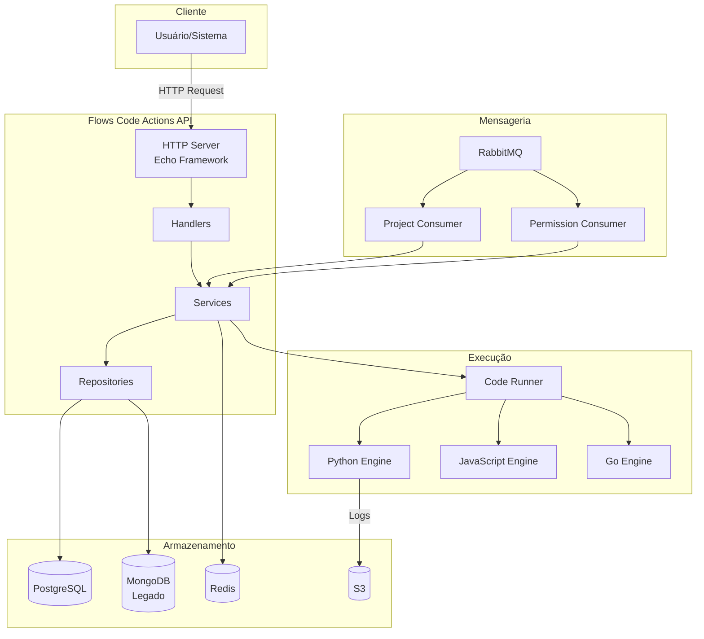
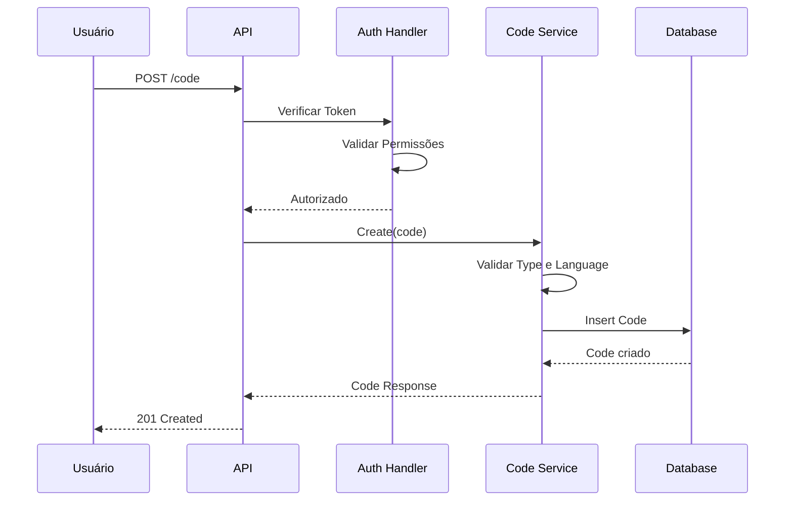
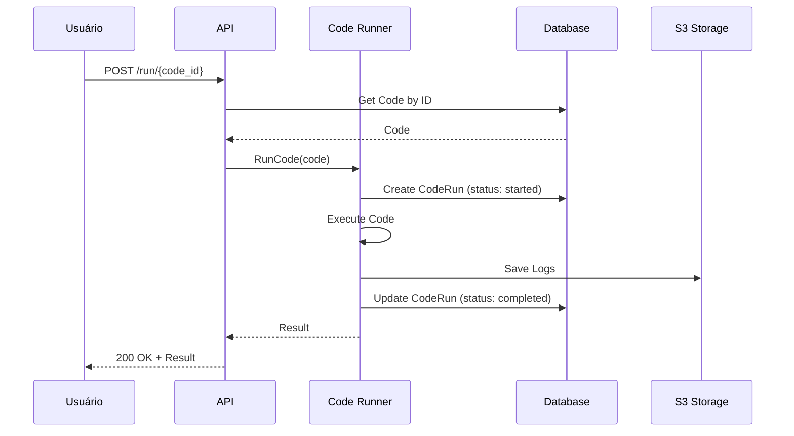

# 1. Visão Geral

## O que é o Flows Code Actions?

O **Flows Code Actions** é um serviço de execução de código dinâmico que permite aos usuários criar, gerenciar e executar código personalizado em Python, JavaScript ou Go. O sistema é projetado para ser integrado a fluxos de automação (como chatbots) ou para expor funcionalidades customizadas como endpoints HTTP.

## Casos de Uso

### 1. Automação de Fluxos (Type: `flow`)
Código executado internamente como parte de um fluxo de automação. Ideal para:
- Processamento de dados
- Integrações com APIs externas
- Transformações de dados
- Lógica de negócio customizada

### 2. Endpoints HTTP (Type: `endpoint`)
Código exposto como endpoint HTTP público. Ideal para:
- Webhooks
- APIs customizadas
- Integrações com sistemas externos
- Microserviços leves

## Fluxo de Funcionamento Geral

## Ciclo de Vida de um Code Action

### Criação

### Execução

## Principais Componentes

### 1. Code (Código)
Representa um código que pode ser executado. Contém:
- Nome e identificador
- Código fonte
- Linguagem (python, javascript, go)
- Tipo (flow, endpoint)
- Projeto associado
- Timeout de execução

### 2. CodeRun (Execução)
Representa uma execução de um código. Contém:
- Referência ao código
- Status (queued, started, completed, failed)
- Resultado da execução
- Parâmetros e headers utilizados
- Timestamps

### 3. CodeLog (Log)
Logs gerados durante a execução de um código. Contém:
- Referência ao CodeRun
- Tipo de log (debug, info, error)
- Conteúdo do log

### 4. CodeLib (Biblioteca)
Bibliotecas disponíveis para uso no código. Atualmente suporta:
- Bibliotecas Python (pip packages)

### 5. Project (Projeto)
Agrupa códigos e gerencia autorizações. Contém:
- UUID único
- Nome
- Lista de autorizações

### 6. UserPermission (Permissão)
Define permissões de usuários em projetos. Contém:
- Projeto associado
- Email do usuário
- Papel (Viewer=1, Contributor=2, Moderator=3)

## Linguagens Suportadas

| Linguagem | Status | Observações |
|-----------|--------|-------------|
| **Python** | ✅ Completo | Suporte a bibliotecas externas via pip |
| **JavaScript** | ✅ Básico | Execução via Node.js |
| **Go** | ✅ Básico | Compilação e execução dinâmica |

## Limites e Configurações

| Parâmetro | Valor Padrão | Descrição |
|-----------|--------------|-----------|
| Timeout mínimo | 5 segundos | Tempo mínimo de execução |
| Timeout máximo | 300 segundos | Tempo máximo de execução |
| Timeout padrão | 60 segundos | Timeout se não especificado |
| Rate Limit | 600 req/60s | Limite por code_id |
| Retenção de Logs | 30 dias | Período de retenção padrão |
