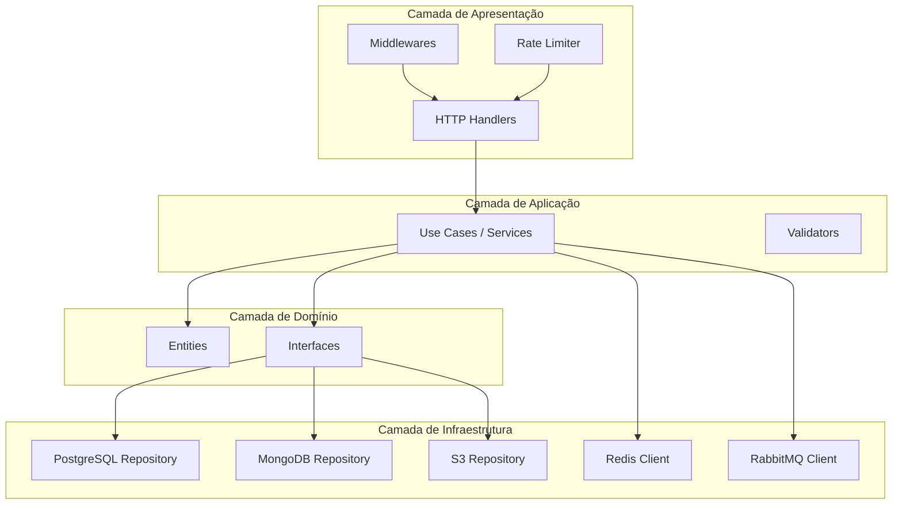
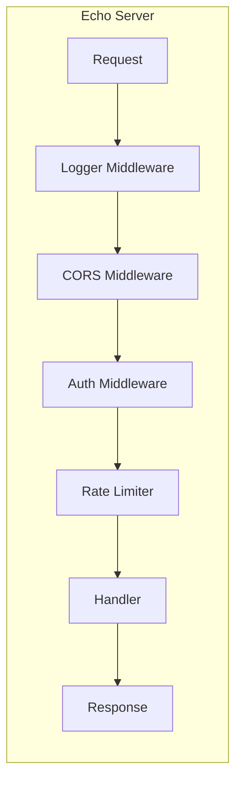
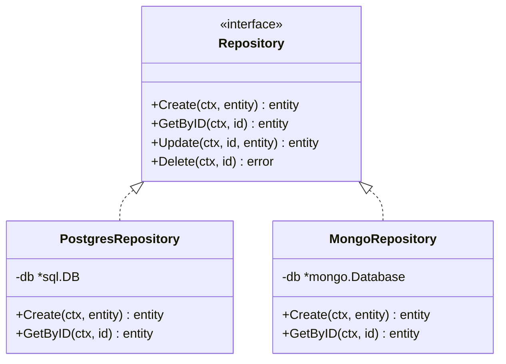
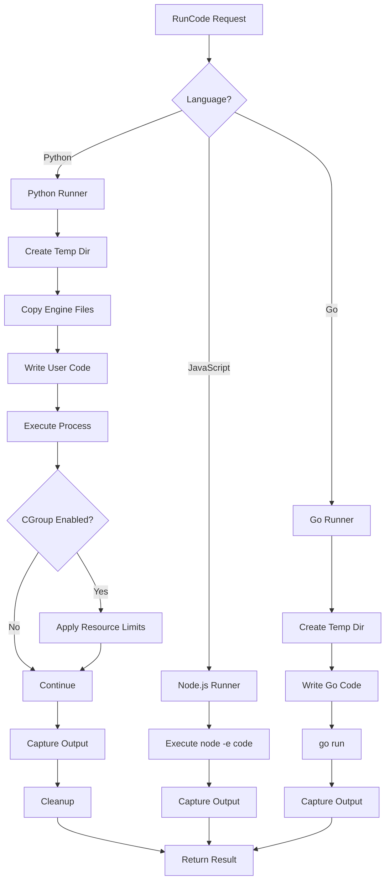
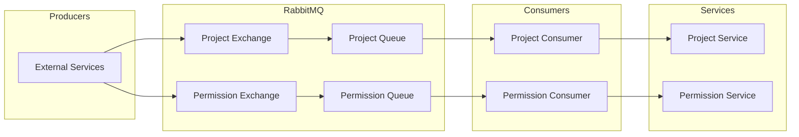
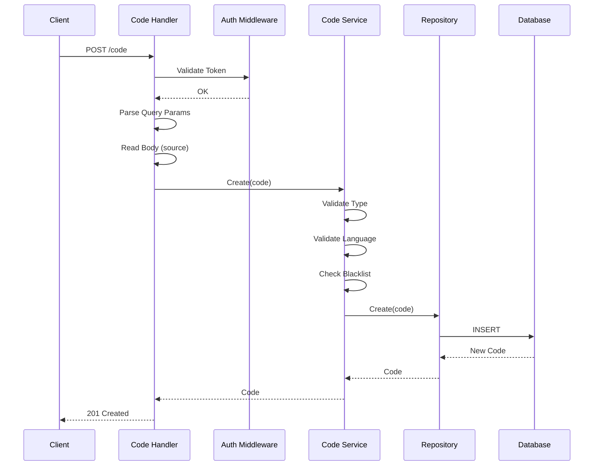
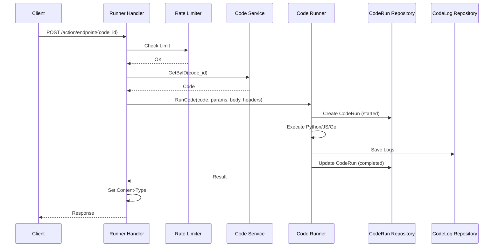
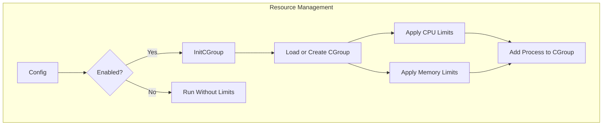
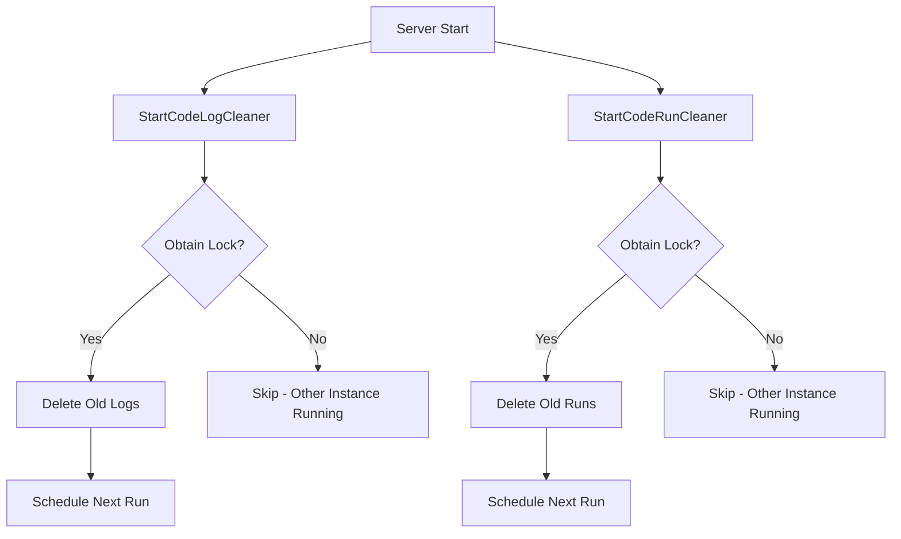

# 2. Arquitetura

## Arquitetura em Camadas

O Flows Code Actions segue uma arquitetura em camadas bem definida:

## Componentes Principais

### 1. HTTP Server (Echo)

O servidor HTTP utiliza o framework Echo e implementa:

**Middlewares:**
- **Request Logger**: Log de todas as requisições
- **CORS**: Configuração de Cross-Origin
- **Auth Token**: Validação de tokens de autenticação
- **Rate Limiter**: Limite de requisições por código

### 2. Padrão Repository

Cada entidade segue o padrão Repository para abstração do banco de dados:

### 3. Code Runner

O Code Runner é responsável por executar código em diferentes linguagens:

### 4. Event-Driven Architecture

O sistema utiliza RabbitMQ para eventos assíncronos:

## Fluxo de Dados

### Criação de Código

### Execução de Código (Action Endpoint)

## Gerenciamento de Recursos

O sistema suporta CGroups para limitar recursos de execução:

**Configurações disponíveis:**
- `CPU Shares`: Proporção de CPU
- `CPU Quota`: Limite absoluto de CPU
- `Memory Limit`: Limite de memória
- `Memory Reservation`: Reserva de memória

## Armazenamento

### PostgreSQL (Principal)
- Codes
- CodeRuns
- CodeLibs
- UserPermissions
- Projects

### MongoDB (Legado)
- Suporte mantido para compatibilidade
- Mesmas entidades do PostgreSQL

### S3 (Logs)
- CodeLogs armazenados como objetos
- Organização por prefixo configurável
- Suporte a LocalStack para desenvolvimento

### Redis
- Cache de sessões
- Rate limiting
- Locks distribuídos para tarefas de limpeza

## Cleaners (Tarefas de Limpeza)

O sistema executa tarefas periódicas de limpeza:

**Configurações:**
- `ScheduleTime`: Horário de execução (padrão: 01:00)
- `RetentionPeriod`: Período de retenção em dias (padrão: 30)
