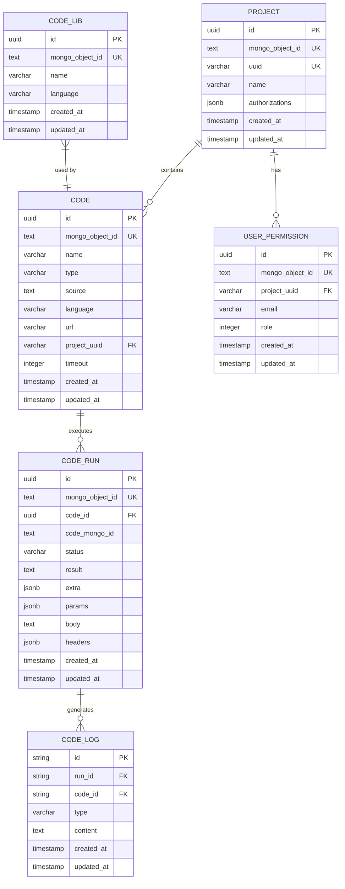
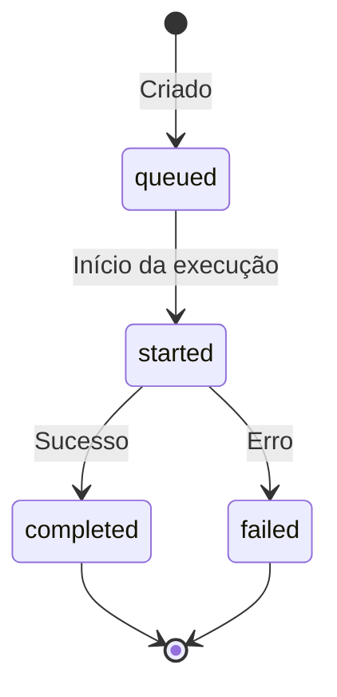
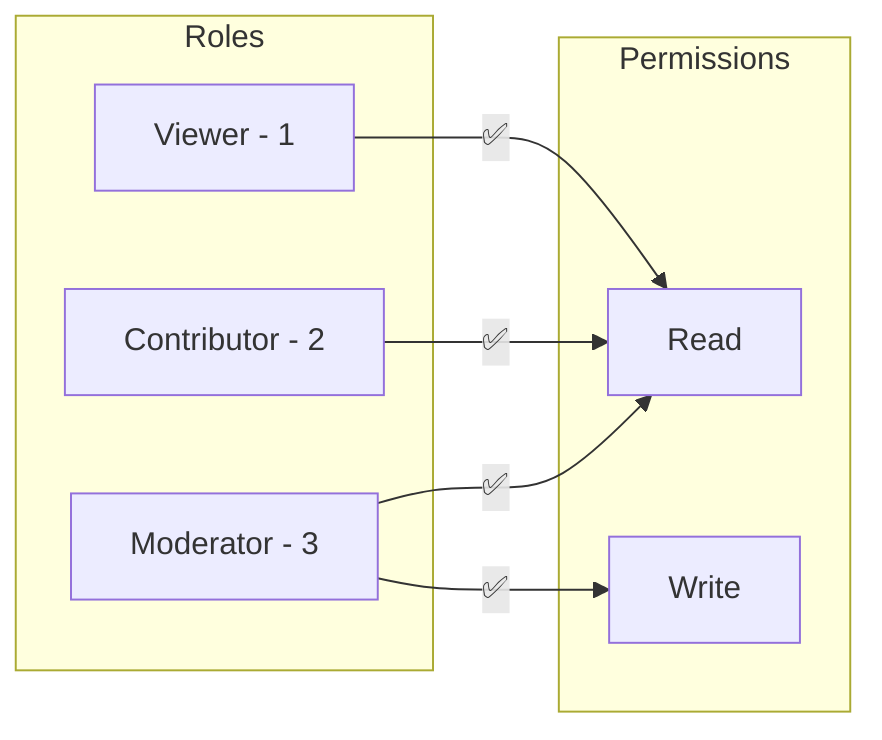

# 3. Entidades e Modelos

## Diagrama de Entidades



---

## 1. Code (Código)

### Descrição
Representa um código que pode ser executado pelo sistema. É a entidade principal da aplicação.

### Estrutura

```go
type Code struct {
    ID            string       `json:"id"`            // UUID PostgreSQL
    MongoObjectID string       `json:"mongo_object_id"` // ObjectID MongoDB (legado)
    Name          string       `json:"name"`          // Nome do código
    Type          CodeType     `json:"type"`          // Tipo: flow ou endpoint
    Source        string       `json:"source"`        // Código fonte
    Language      LanguageType `json:"language"`      // Linguagem de programação
    URL           string       `json:"url"`           // URL (para endpoints)
    ProjectUUID   string       `json:"project_uuid"`  // UUID do projeto
    Timeout       int          `json:"timeout"`       // Timeout em segundos (5-300)
    CreatedAt     time.Time    `json:"created_at"`
    UpdatedAt     time.Time    `json:"updated_at"`
}
```

### Tipos de Código (CodeType)

| Tipo | Valor | Descrição |
|------|-------|-----------|
| Flow | `flow` | Código executado internamente em fluxos de automação |
| Endpoint | `endpoint` | Código exposto como endpoint HTTP acessível externamente |

### Linguagens Suportadas (LanguageType)

| Linguagem | Valor | Engine |
|-----------|-------|--------|
| Python | `python` | Interpretador Python com suporte a bibliotecas |
| JavaScript | `javascript` | Node.js |
| Go | `go` | Compilação e execução dinâmica |

### Regras de Negócio

1. **Timeout**:
   - Mínimo: 5 segundos
   - Máximo: 120 segundos (código limita a 120 mesmo se passar 300)
   - Padrão: 60 segundos

2. **Blacklist**: O sistema pode bloquear códigos que contenham termos na blacklist configurada

3. **Validações**:
   - `type` deve ser `flow` ou `endpoint`
   - `language` deve ser `python`, `javascript` ou `go`
   - `name` é obrigatório
   - `source` é obrigatório
   - `project_uuid` é obrigatório

### Exemplo JSON

```json
{
  "id": "550e8400-e29b-41d4-a716-446655440000",
  "name": "Calcular Desconto",
  "type": "flow",
  "source": "def run(params):\n    return params.get('valor') * 0.9",
  "language": "python",
  "project_uuid": "proj-123-456",
  "timeout": 30,
  "created_at": "2024-01-15T10:30:00Z",
  "updated_at": "2024-01-15T10:30:00Z"
}
```

---

## 2. CodeRun (Execução)

### Descrição
Representa uma execução específica de um código. Armazena parâmetros de entrada, resultado e metadados da execução.

### Estrutura

```go
type CodeRun struct {
    ID            string                 `json:"id"`
    MongoObjectID string                 `json:"mongo_object_id"`
    CodeID        string                 `json:"code_id"`       // Referência ao Code
    CodeMongoID   string                 `json:"code_mongo_id"` // MongoDB ObjectID do Code
    Status        CodeRunStatus          `json:"status"`        // Status da execução
    Result        string                 `json:"result"`        // Resultado da execução
    Extra         map[string]interface{} `json:"extra"`         // Metadados extras
    Params        map[string]interface{} `json:"params"`        // Parâmetros de entrada
    Body          string                 `json:"body"`          // Body da requisição
    Headers       map[string]interface{} `json:"headers"`       // Headers HTTP
    CreatedAt     time.Time              `json:"created_at"`
    UpdatedAt     time.Time              `json:"updated_at"`
}
```

### Status de Execução (CodeRunStatus)



| Status | Valor | Descrição |
|--------|-------|-----------|
| Queued | `queued` | Execução na fila |
| Started | `started` | Execução em andamento |
| Completed | `completed` | Execução concluída com sucesso |
| Failed | `failed` | Execução falhou |

### Campo Extra
O campo `extra` pode conter:

| Campo | Tipo | Descrição |
|-------|------|-----------|
| `status_code` | int | Código HTTP de resposta (para endpoints) |
| `content_type` | string | Tipo de conteúdo da resposta (json, html, string) |

### Exemplo JSON

```json
{
  "id": "660e8400-e29b-41d4-a716-446655440001",
  "code_id": "550e8400-e29b-41d4-a716-446655440000",
  "status": "completed",
  "result": "{\"desconto\": 90}",
  "extra": {
    "status_code": 200,
    "content_type": "json"
  },
  "params": {
    "valor": 100
  },
  "body": "",
  "headers": {
    "Content-Type": ["application/json"]
  },
  "created_at": "2024-01-15T10:35:00Z",
  "updated_at": "2024-01-15T10:35:02Z"
}
```

---

## 3. CodeLog (Log de Execução)

### Descrição
Armazena logs gerados durante a execução de um código.

### Estrutura

```go
type CodeLog struct {
    ID        string    `json:"id"`
    RunID     string    `json:"run_id"`     // Referência ao CodeRun
    CodeID    string    `json:"code_id"`    // Referência ao Code
    Type      LogType   `json:"type"`       // Tipo do log
    Content   string    `json:"content"`    // Conteúdo do log
    CreatedAt time.Time `json:"created_at"`
    UpdatedAt time.Time `json:"updated_at"`
}
```

### Tipos de Log (LogType)

| Tipo | Valor | Descrição |
|------|-------|-----------|
| Debug | `debug` | Logs de debug/desenvolvimento |
| Info | `info` | Informações gerais |
| Error | `error` | Erros e exceções |

### Armazenamento
- **MongoDB**: Armazenado na collection `codelogs`
- **S3**: Armazenado como objetos JSON com prefixo configurável

### Exemplo JSON

```json
{
  "id": "log-123",
  "run_id": "660e8400-e29b-41d4-a716-446655440001",
  "code_id": "550e8400-e29b-41d4-a716-446655440000",
  "type": "info",
  "content": "Processando valor: 100",
  "created_at": "2024-01-15T10:35:01Z",
  "updated_at": "2024-01-15T10:35:01Z"
}
```

---

## 4. CodeLib (Biblioteca)

### Descrição
Representa uma biblioteca externa disponível para uso nos códigos. Atualmente suporta apenas bibliotecas Python.

### Estrutura

```go
type CodeLib struct {
    ID            string       `json:"id"`
    MongoObjectID string       `json:"mongo_object_id"`
    Name          string       `json:"name"`     // Nome da biblioteca (ex: numpy)
    Language      LanguageType `json:"language"` // Linguagem (apenas python)
    CreatedAt     time.Time    `json:"created_at"`
    UpdatedAt     time.Time    `json:"updated_at"`
}
```

### Bibliotecas Python Padrão (incluídas)
As seguintes bibliotecas Python são consideradas padrão e não precisam ser instaladas:
- `base64`, `datetime`, `email`, `hashlib`, `imaplib`, `io`, `json`, `math`, `os`, `random`, `re`, `sys`, `tempfile`, `time`, `urllib`, `urllib.parse`, `urllib.request`, `wave`

### Funcionalidades

1. **Extração de bibliotecas**: O sistema analisa o código Python e extrai bibliotecas necessárias
2. **Instalação**: Bibliotecas são instaladas via `pip install --no-cache-dir --break-system-packages`

### Exemplo JSON

```json
{
  "id": "770e8400-e29b-41d4-a716-446655440002",
  "name": "requests",
  "language": "python",
  "created_at": "2024-01-10T08:00:00Z",
  "updated_at": "2024-01-10T08:00:00Z"
}
```

---

## 5. Project (Projeto)

### Descrição
Agrupa códigos e define autorizações de acesso.

### Estrutura

```go
type Project struct {
    ID            string `json:"id"`
    MongoObjectID string `json:"mongo_object_id"`
    UUID          string `json:"uuid"`   // UUID único do projeto
    Name          string `json:"name"`   // Nome do projeto
    Authorizations []struct {
        UserEmail string `json:"user_email"`
        Role      string `json:"role"`
    } `json:"authorizations"`
    CreatedAt time.Time `json:"created_at"`
    UpdatedAt time.Time `json:"updated_at"`
}
```

### Exemplo JSON

```json
{
  "id": "880e8400-e29b-41d4-a716-446655440003",
  "uuid": "proj-abc-123",
  "name": "Meu Projeto de Automação",
  "authorizations": [
    {"user_email": "admin@empresa.com", "role": "admin"},
    {"user_email": "dev@empresa.com", "role": "contributor"}
  ],
  "created_at": "2024-01-01T00:00:00Z",
  "updated_at": "2024-01-15T12:00:00Z"
}
```

---

## 6. UserPermission (Permissão de Usuário)

### Descrição
Define as permissões de um usuário em um projeto específico.

### Estrutura

```go
type UserPermission struct {
    ID            string    `json:"id"`
    MongoObjectID string    `json:"mongo_object_id"`
    ProjectUUID   string    `json:"project_uuid"` // UUID do projeto
    Email         string    `json:"email"`        // Email do usuário
    Role          Role      `json:"role"`         // Papel/Role do usuário
    CreatedAt     time.Time `json:"created_at"`
    UpdatedAt     time.Time `json:"updated_at"`
}
```

### Papéis (Roles)

| Role | Valor | Permissão Read | Permissão Write |
|------|-------|----------------|-----------------|
| Viewer | `1` | ✅ | ❌ |
| Contributor | `2` | ✅ | ❌ |
| Moderator | `3` | ✅ | ✅ |

### Matriz de Permissões



### Regra de Verificação

```go
func HasPermission(user *UserPermission, permission PermissionAccess) bool {
    if permission == ReadPermission && user.Role >= 1 {
        return true
    }
    if permission == WritePermission && user.Role >= 3 {
        return true
    }
    return false
}
```

### Exemplo JSON

```json
{
  "id": "990e8400-e29b-41d4-a716-446655440004",
  "project_uuid": "proj-abc-123",
  "email": "usuario@empresa.com",
  "role": 3,
  "created_at": "2024-01-05T09:00:00Z",
  "updated_at": "2024-01-05T09:00:00Z"
}
```
