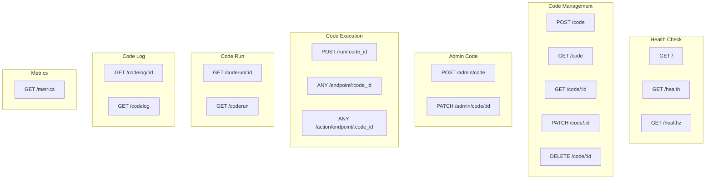
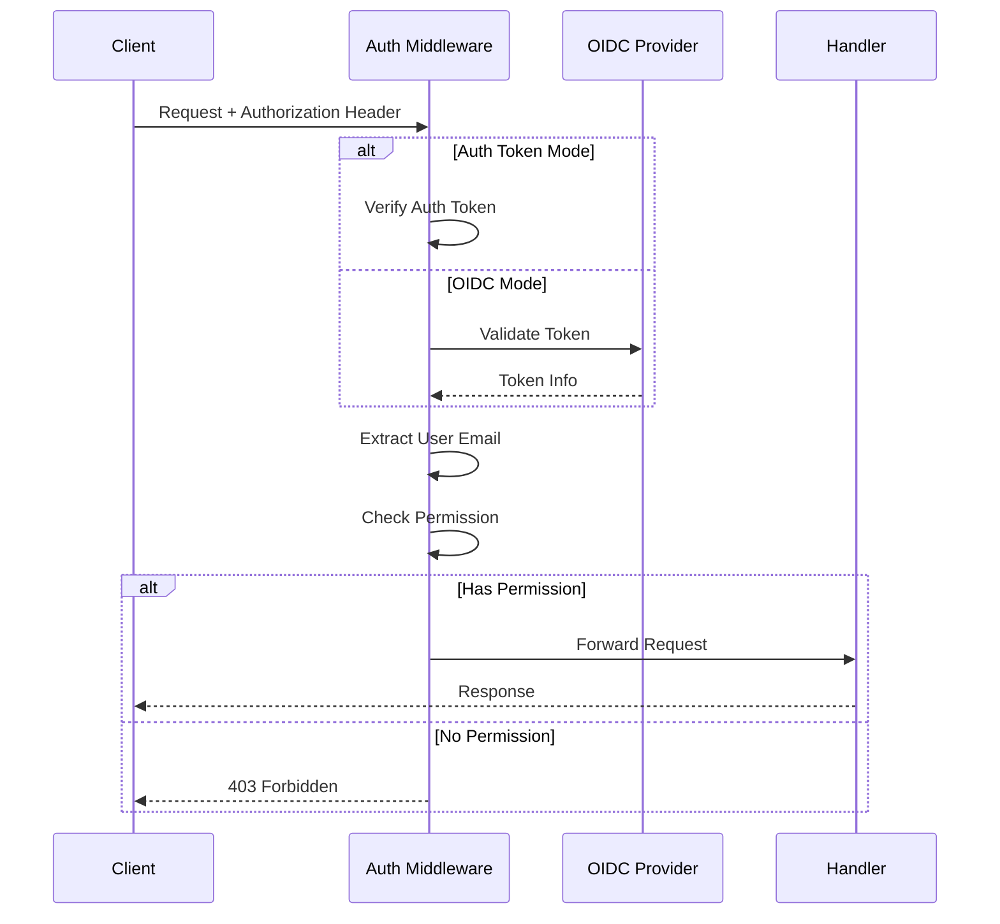

# 4. Endpoints da API

## Visão Geral dos Endpoints



---

## Health Check

### GET /
Retorna status básico do servidor.

**Autenticação:** Não requerida

**Response:**
```json
{
  "status": "ok"
}
```

### GET /health
Retorna status detalhado da saúde do servidor.

**Autenticação:** Não requerida

### GET /healthz
Endpoint simplificado para monitoramento (Kubernetes readiness/liveness probes).

**Autenticação:** Não requerida

---

## Code Management

### POST /code
Cria um novo código.

**Autenticação:** Requerida (Write Permission)

**Query Parameters:**
| Parâmetro | Tipo | Obrigatório | Descrição |
|-----------|------|-------------|-----------|
| `project_uuid` | string | ✅ | UUID do projeto |
| `name` | string | ✅ | Nome do código |
| `language` | string | ✅ | Linguagem (python, javascript, go) |
| `type` | string | ✅ | Tipo (flow, endpoint) |

**Body:** O código fonte (texto plano)

**Headers:**
```
Authorization: Bearer <token>
Content-Type: text/plain
```

**Request Example:**
```bash
curl -X POST "http://localhost:8050/code?project_uuid=proj-123&name=MeuCodigo&language=python&type=flow" \
  -H "Authorization: Bearer token123" \
  -H "Content-Type: text/plain" \
  -d 'def run(params):
    return {"resultado": params.get("valor") * 2}'
```

**Response (201 Created):**
```json
{
  "id": "550e8400-e29b-41d4-a716-446655440000",
  "name": "MeuCodigo",
  "type": "flow",
  "source": "def run(params):\n    return {\"resultado\": params.get(\"valor\") * 2}",
  "language": "python",
  "project_uuid": "proj-123",
  "timeout": 60,
  "created_at": "2024-01-15T10:30:00Z",
  "updated_at": "2024-01-15T10:30:00Z"
}
```

---

### GET /code
Lista códigos de um projeto.

**Autenticação:** Requerida (Read Permission)

**Query Parameters:**
| Parâmetro | Tipo | Obrigatório | Descrição |
|-----------|------|-------------|-----------|
| `project_uuid` | string | ✅ | UUID do projeto |
| `code_type` | string | ❌ | Filtrar por tipo (flow, endpoint) |

**Response (200 OK):**
```json
[
  {
    "id": "550e8400-e29b-41d4-a716-446655440000",
    "name": "MeuCodigo",
    "type": "flow",
    "language": "python",
    "project_uuid": "proj-123",
    "created_at": "2024-01-15T10:30:00Z",
    "updated_at": "2024-01-15T10:30:00Z"
  }
]
```

---

### GET /code/:id
Obtém um código específico pelo ID.

**Autenticação:** Requerida (Read Permission)

**Path Parameters:**
| Parâmetro | Tipo | Descrição |
|-----------|------|-----------|
| `id` | string | ID do código (UUID) |

**Response (200 OK):**
```json
{
  "id": "550e8400-e29b-41d4-a716-446655440000",
  "name": "MeuCodigo",
  "type": "flow",
  "source": "def run(params):\n    return {\"resultado\": params.get(\"valor\") * 2}",
  "language": "python",
  "project_uuid": "proj-123",
  "timeout": 60,
  "created_at": "2024-01-15T10:30:00Z",
  "updated_at": "2024-01-15T10:30:00Z"
}
```

**Response (404 Not Found):**
```json
{
  "message": "code not found"
}
```

---

### PATCH /code/:id
Atualiza um código existente.

**Autenticação:** Requerida (Write Permission)

**Path Parameters:**
| Parâmetro | Tipo | Descrição |
|-----------|------|-----------|
| `id` | string | ID do código (UUID) |

**Query Parameters:**
| Parâmetro | Tipo | Obrigatório | Descrição |
|-----------|------|-------------|-----------|
| `name` | string | ❌ | Novo nome |
| `language` | string | ❌ | Nova linguagem |
| `type` | string | ❌ | Novo tipo |
| `timeout` | int | ❌ | Novo timeout (5-300 segundos) |

**Body:** Novo código fonte (texto plano)

**Response (200 OK):**
```json
{
  "id": "550e8400-e29b-41d4-a716-446655440000",
  "name": "MeuCodigoAtualizado",
  "type": "flow",
  "source": "def run(params):\n    return {\"resultado\": params.get(\"valor\") * 3}",
  "language": "python",
  "project_uuid": "proj-123",
  "timeout": 30,
  "created_at": "2024-01-15T10:30:00Z",
  "updated_at": "2024-01-15T11:00:00Z"
}
```

---

### DELETE /code/:id
Remove um código.

**Autenticação:** Requerida (Write Permission)

**Path Parameters:**
| Parâmetro | Tipo | Descrição |
|-----------|------|-----------|
| `id` | string | ID do código (UUID) |

**Response (200 OK):** No content

---

## Code Execution

### POST /run/:code_id
Executa um código (uso interno).

**Autenticação:** Requerida

**Path Parameters:**
| Parâmetro | Tipo | Descrição |
|-----------|------|-----------|
| `code_id` | string | ID do código |

**Response (200 OK):**
```json
{
  "code_id": "550e8400-e29b-41d4-a716-446655440000",
  "result": "{\"resultado\": 200}"
}
```

---

### ANY /endpoint/:code_id
Executa um código do tipo endpoint (qualquer método HTTP).

**Autenticação:** Não requerida (endpoint público)

**Path Parameters:**
| Parâmetro | Tipo | Descrição |
|-----------|------|-----------|
| `code_id` | string | ID do código |

**Response:** String com o resultado da execução

---

### ANY /action/endpoint/:code_id
Executa um código do tipo endpoint com rate limiting e métricas.

**Autenticação:** Não requerida (endpoint público, mas com rate limit)

**Path Parameters:**
| Parâmetro | Tipo | Descrição |
|-----------|------|-----------|
| `code_id` | string | ID do código |

**Query Parameters:** Passados como `params` para o código

**Body:** Passado como `body` para o código

**Headers:** Passados como `headers` para o código

**Rate Limit:** 600 requisições por minuto por `code_id`

**Response Headers:**
- `Content-Type`: Baseado no `content_type` retornado pelo código
  - `json` → `application/json; charset=UTF-8`
  - `html` → `text/html; charset=UTF-8`
  - default → `text/plain; charset=UTF-8`

**Response Status:** Baseado no `status_code` retornado pelo código (padrão: 200)

**Timeout:** Baseado no timeout configurado no código (padrão: 60s, máx: 120s)

---

## Code Run

### GET /coderun/:id
Obtém detalhes de uma execução específica.

**Autenticação:** Requerida (Read Permission)

**Path Parameters:**
| Parâmetro | Tipo | Descrição |
|-----------|------|-----------|
| `id` | string | ID do CodeRun |

**Response (200 OK):**
```json
{
  "id": "660e8400-e29b-41d4-a716-446655440001",
  "code_id": "550e8400-e29b-41d4-a716-446655440000",
  "status": "completed",
  "result": "{\"resultado\": 200}",
  "extra": {
    "status_code": 200,
    "content_type": "json"
  },
  "params": {"valor": 100},
  "body": "",
  "headers": {},
  "created_at": "2024-01-15T10:35:00Z",
  "updated_at": "2024-01-15T10:35:02Z"
}
```

---

### GET /coderun
Lista execuções de um código.

**Autenticação:** Requerida (Read Permission)

**Query Parameters:**
| Parâmetro | Tipo | Obrigatório | Descrição |
|-----------|------|-------------|-----------|
| `code_id` | string | ✅ | ID do código |

**Response (200 OK):**
```json
[
  {
    "id": "660e8400-e29b-41d4-a716-446655440001",
    "code_id": "550e8400-e29b-41d4-a716-446655440000",
    "status": "completed",
    "created_at": "2024-01-15T10:35:00Z"
  }
]
```

---

## Code Log

### GET /codelog/:id
Obtém um log específico.

**Autenticação:** Requerida (Read Permission)

**Path Parameters:**
| Parâmetro | Tipo | Descrição |
|-----------|------|-----------|
| `id` | string | ID do CodeLog |

**Response (200 OK):**
```json
{
  "id": "log-123",
  "run_id": "660e8400-e29b-41d4-a716-446655440001",
  "code_id": "550e8400-e29b-41d4-a716-446655440000",
  "type": "info",
  "content": "Processando valor: 100",
  "created_at": "2024-01-15T10:35:01Z"
}
```

---

### GET /codelog
Lista logs de uma execução.

**Autenticação:** Requerida (Read Permission)

**Query Parameters:**
| Parâmetro | Tipo | Obrigatório | Descrição |
|-----------|------|-------------|-----------|
| `run_id` | string | ✅ | ID do CodeRun |
| `code_id` | string | ✅ | ID do Code |
| `limit` | int | ❌ | Limite de resultados |
| `page` | int | ❌ | Página para paginação |

**Response (200 OK):**
```json
[
  {
    "id": "log-123",
    "run_id": "660e8400-e29b-41d4-a716-446655440001",
    "type": "info",
    "content": "Processando valor: 100",
    "created_at": "2024-01-15T10:35:01Z"
  }
]
```

---

## Metrics

### GET /metrics
Endpoint Prometheus para coleta de métricas.

**Autenticação:** Não requerida

**Response:** Formato Prometheus

```
# HELP codeactions_code_created_total Total de códigos criados
# TYPE codeactions_code_created_total counter
codeactions_code_created_total{project_uuid="proj-123",code_id="code-456"} 1

# HELP codeactions_code_run_total Total de execuções de código
# TYPE codeactions_code_run_total counter
codeactions_code_run_total{project_uuid="proj-123",code_id="code-456"} 150

# HELP codeactions_code_run_duration_seconds Duração das execuções de código
# TYPE codeactions_code_run_duration_seconds histogram
codeactions_code_run_duration_seconds_bucket{le="0.5"} 100
codeactions_code_run_duration_seconds_bucket{le="1"} 140
codeactions_code_run_duration_seconds_bucket{le="+Inf"} 150
```

---

## Códigos de Erro

| Código | Descrição |
|--------|-----------|
| 400 | Bad Request - Parâmetros inválidos |
| 401 | Unauthorized - Token inválido ou ausente |
| 403 | Forbidden - Sem permissão para o recurso |
| 404 | Not Found - Recurso não encontrado |
| 408 | Request Timeout - Timeout na execução do código |
| 429 | Too Many Requests - Rate limit excedido |
| 500 | Internal Server Error - Erro interno |

---

## Fluxo de Autenticação


