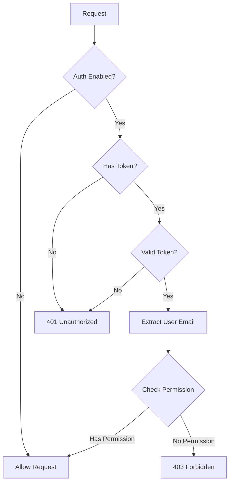
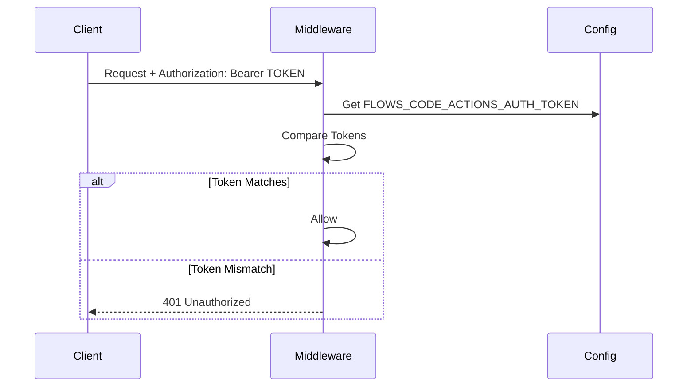
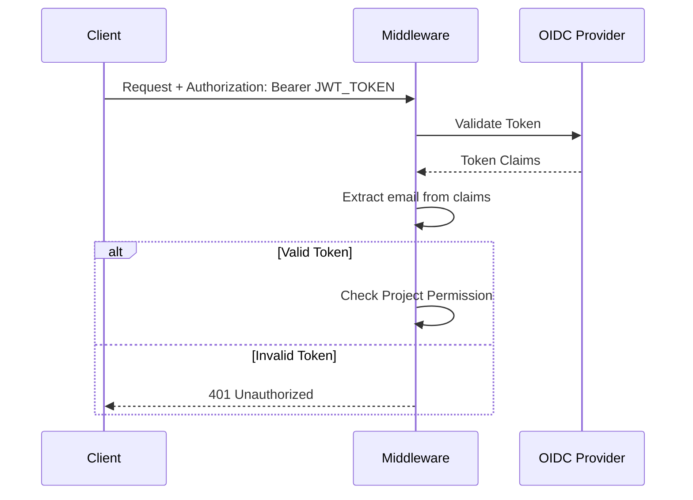
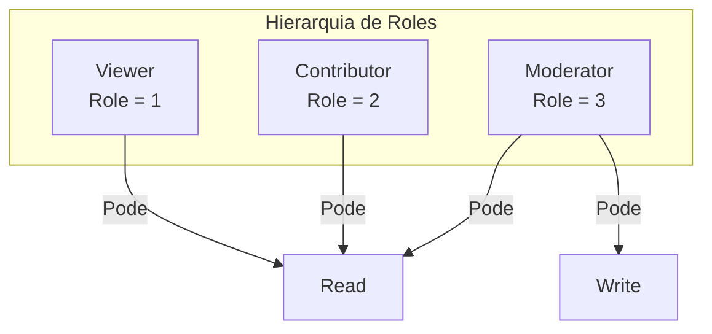
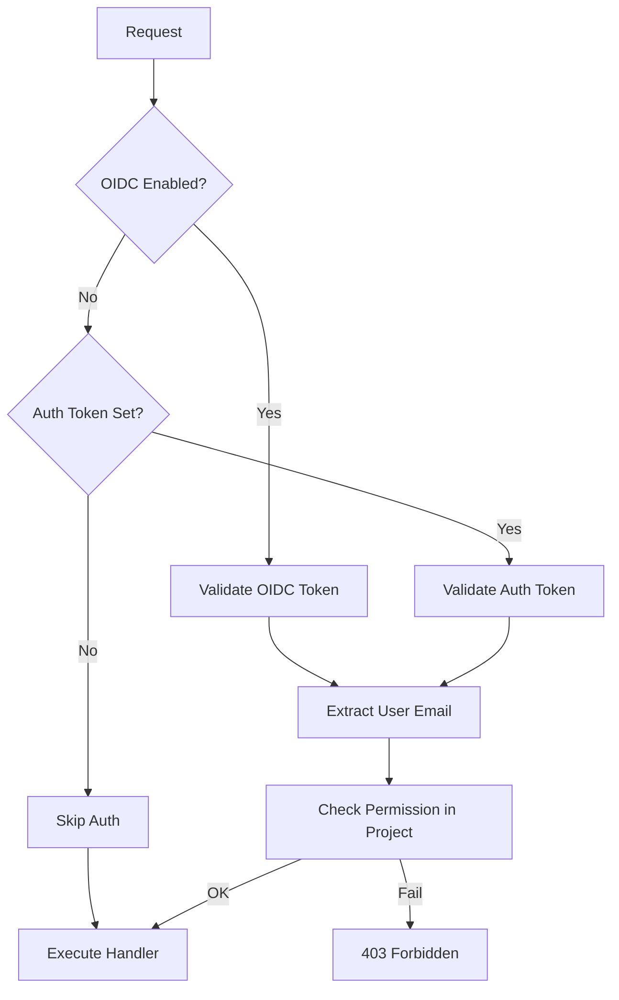
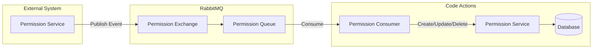
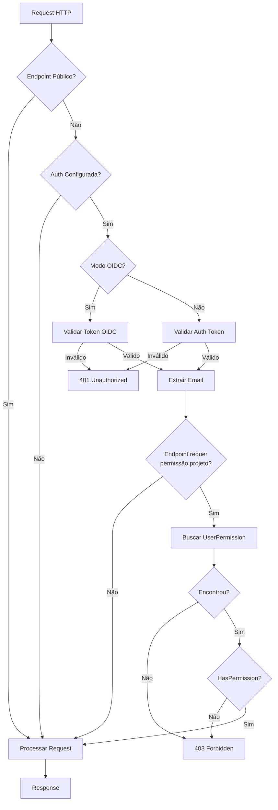

# 6. Sistema de Permissões

## Visão Geral

O sistema de permissões do Flows Code Actions controla o acesso aos recursos baseado em:
1. **Token de Autenticação**: Valida a identidade do usuário
2. **Permissões por Projeto**: Define o que o usuário pode fazer em cada projeto

## Fluxo de Autorização



## Modos de Autenticação

### 1. Auth Token Simples

Autenticação via token estático configurado em variável de ambiente.



**Configuração:**
```bash
FLOWS_CODE_ACTIONS_AUTH_TOKEN=seu-token-secreto
```

**Uso:**
```bash
curl -H "Authorization: Bearer seu-token-secreto" http://api/code
```

### 2. OIDC (OpenID Connect)

Autenticação via provedor OIDC (ex: Keycloak).



**Configuração:**
```bash
FLOWS_CODE_ACTIONS_OIDC_AUTH_ENABLED=true
FLOWS_CODE_ACTIONS_OIDC_REALM=seu-realm
FLOWS_CODE_ACTIONS_OIDC_HOST=https://keycloak.example.com
```

## Níveis de Permissão

### Roles (Papéis)



| Role | Valor | Descrição |
|------|-------|-----------|
| **Viewer** | 1 | Pode visualizar códigos e execuções |
| **Contributor** | 2 | Pode visualizar códigos e execuções |
| **Moderator** | 3 | Pode criar, editar e deletar códigos |

### Tipos de Permissão

| Permissão | Valor | Roles Permitidos |
|-----------|-------|------------------|
| **Read** | `read` | Viewer (1+), Contributor (2+), Moderator (3+) |
| **Write** | `write` | Moderator (3+) |

### Lógica de Verificação

```go
func HasPermission(user *UserPermission, permission PermissionAccess) bool {
    // Read: Qualquer role >= 1 tem acesso
    if permission == ReadPermission && user.Role >= 1 {
        return true
    }
    // Write: Apenas role >= 3 (Moderator) tem acesso
    if permission == WritePermission && user.Role >= 3 {
        return true
    }
    return false
}
```

## Endpoints e Permissões

### Matriz de Permissões por Endpoint

| Endpoint | Método | Permissão | Descrição |
|----------|--------|-----------|-----------|
| `/` | GET | - | Health check |
| `/health` | GET | - | Health check |
| `/healthz` | GET | - | Health check |
| `/code` | POST | Write | Criar código |
| `/code` | GET | Read | Listar códigos |
| `/code/:id` | GET | Read | Obter código |
| `/code/:id` | PATCH | Write | Atualizar código |
| `/code/:id` | DELETE | Write | Deletar código |
| `/admin/code` | POST | Write | Criar código (admin) |
| `/admin/code/:id` | PATCH | Write | Atualizar código (admin) |
| `/coderun/:id` | GET | Read | Obter execução |
| `/coderun` | GET | Read | Listar execuções |
| `/codelog/:id` | GET | Read | Obter log |
| `/codelog` | GET | Read | Listar logs |
| `/run/:code_id` | POST | Auth | Executar código |
| `/endpoint/:code_id` | ANY | - | Endpoint público |
| `/action/endpoint/:code_id` | ANY | - | Endpoint público (rate limited) |
| `/metrics` | GET | - | Métricas Prometheus |

## Middleware de Proteção

### ProtectEndpointWithAuthToken

Protege endpoints que requerem autenticação E verificação de permissão no projeto.

```go
func ProtectEndpointWithAuthToken(
    cfg *config.Config, 
    handler echo.HandlerFunc, 
    permission permission.PermissionAccess,
) echo.HandlerFunc
```

**Fluxo:**


### RequireAuthToken

Protege endpoints que requerem apenas autenticação (sem verificação de permissão no projeto).

```go
func RequireAuthToken(cfg *config.Config, handler echo.HandlerFunc) echo.HandlerFunc
```

**Uso:** Endpoint `/run/:code_id`

## Gerenciamento de Permissões via RabbitMQ

O sistema recebe eventos de permissões via RabbitMQ:



### Eventos Suportados

| Evento | Ação |
|--------|------|
| Permission Created | Cria nova permissão de usuário |
| Permission Updated | Atualiza role do usuário |
| Permission Deleted | Remove permissão do usuário |

## Configuração

### Variáveis de Ambiente

```bash
# Auth Token (modo simples)
FLOWS_CODE_ACTIONS_AUTH_TOKEN=token-secreto

# OIDC (modo avançado)
FLOWS_CODE_ACTIONS_OIDC_AUTH_ENABLED=true
FLOWS_CODE_ACTIONS_OIDC_REALM=meu-realm
FLOWS_CODE_ACTIONS_OIDC_HOST=https://keycloak.example.com

# RabbitMQ para eventos de permissão
FLOWS_CODE_ACTIONS_PERMISSION_EXCHANGE=permission-exchange
FLOW_CODE_ACTIONS_PERMISSION_QUEUE=permission-queue
```

## Verificação de Permissão no Código

### Exemplo de Uso

```go
// No handler
func (h *CodeHandler) CreateCode(c echo.Context) error {
    ctx := context.Background()
    projectUUID := c.QueryParam("project_uuid")
    
    // Verifica se o usuário tem permissão de escrita no projeto
    if err := CheckPermission(ctx, c, projectUUID); err != nil {
        return echo.NewHTTPError(http.StatusUnauthorized, err.Error())
    }
    
    // Continua com a criação...
}
```

### Função CheckPermission

```go
func CheckPermission(ctx context.Context, c echo.Context, projectUUID string, permissionRole permission.PermissionAccess) error {
    // Se o sistema de permissões não está configurado, permite
    if Permission == nil {
        log.Info("auth permissions disabled")
        return nil
    }
    
    // Verifica a permissão
    err := Permission.CheckPermission(ctx, c, projectUUID, permissionRole)
    if err != nil {
        return echo.NewHTTPError(http.StatusForbidden, err)
    }
    return nil
}
```

## Diagrama de Decisão Completo


