# 9. Diagramas e Flowcharts

## Arquitetura Completa do Sistema

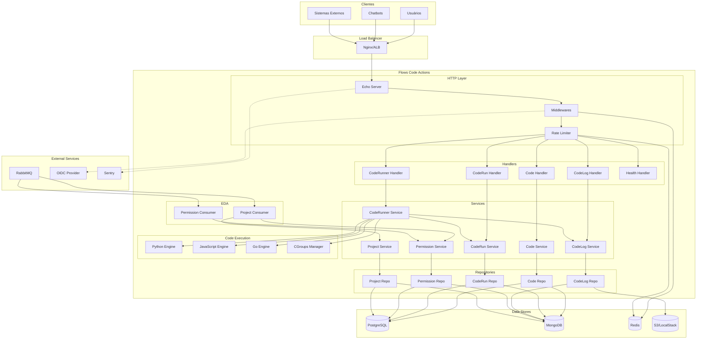

---

## Fluxo de Execução de Código Python

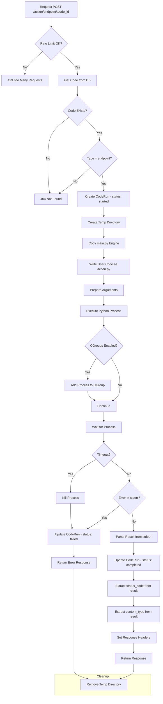

---

## Fluxo de Autenticação e Autorização

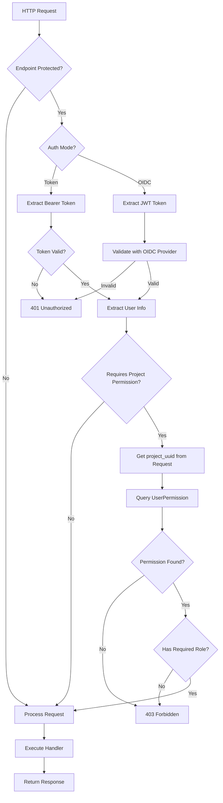

---

## Ciclo de Vida do CodeRun

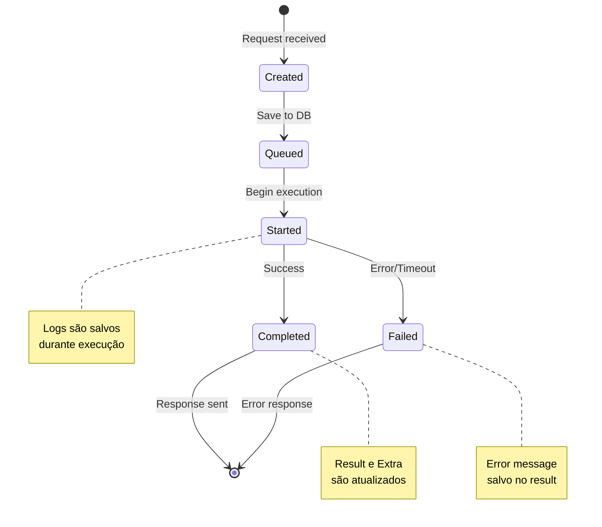

---

## Fluxo de Eventos RabbitMQ

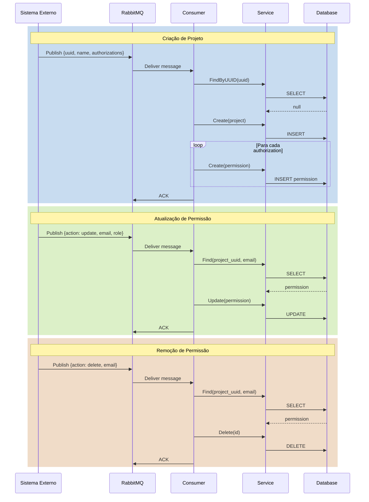

---

## Estrutura do Python Engine

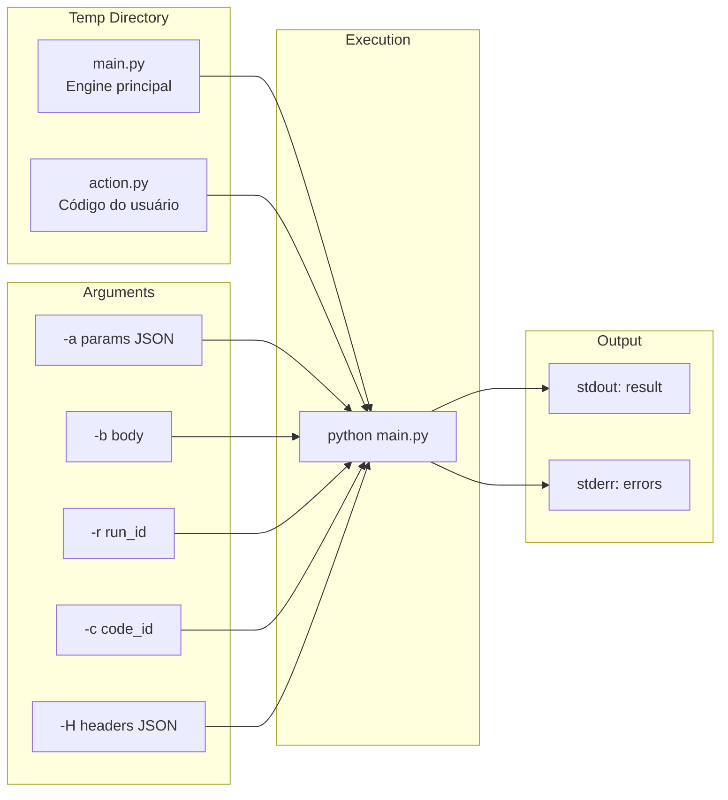

---

## Estrutura de Dados - Relacionamentos

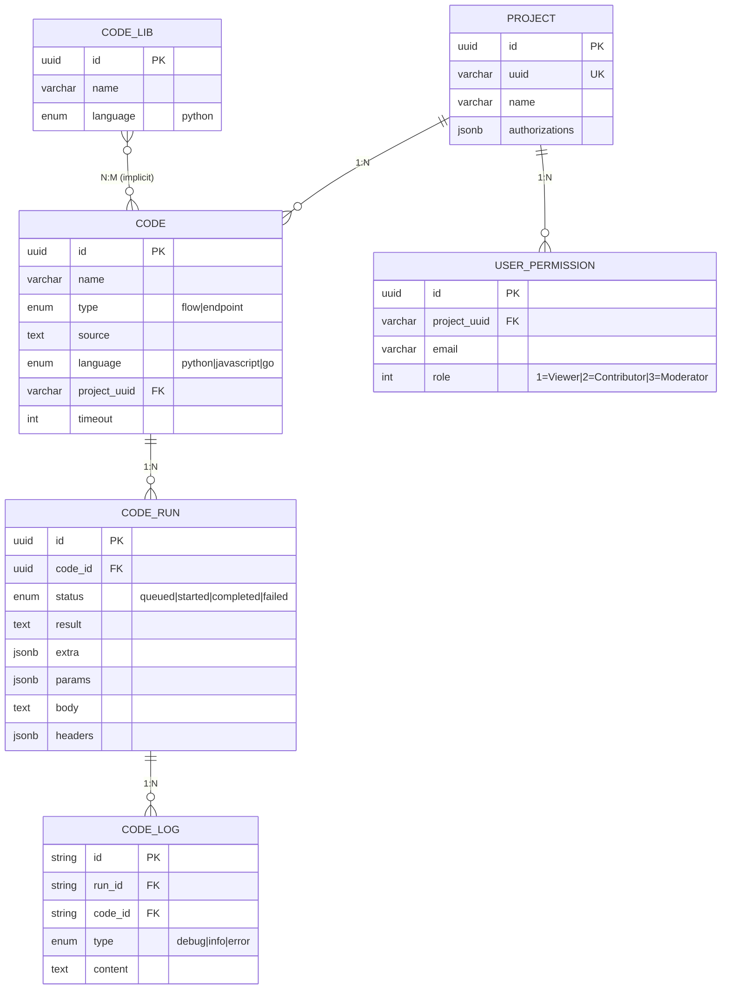

---

## Rate Limiting Flow

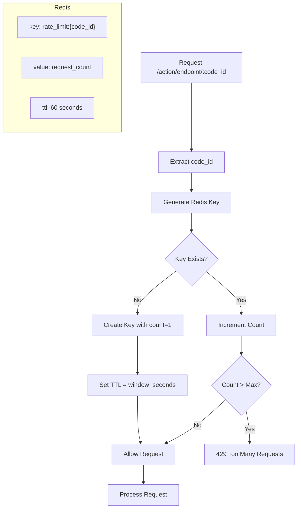

---

## Cleaner Tasks Flow

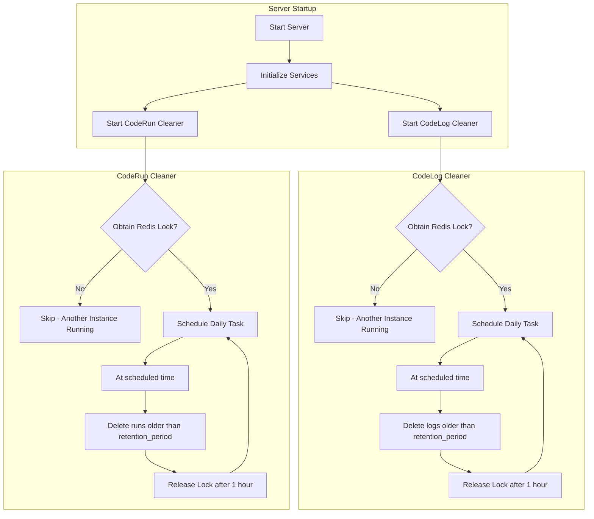

---

## Metrics Collection

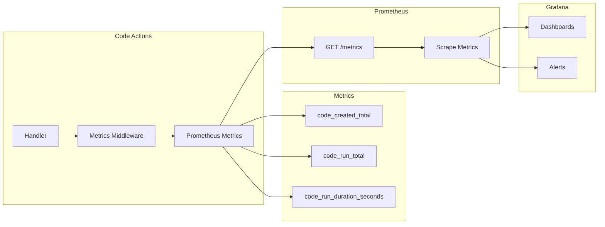

---

## Deployment Architecture

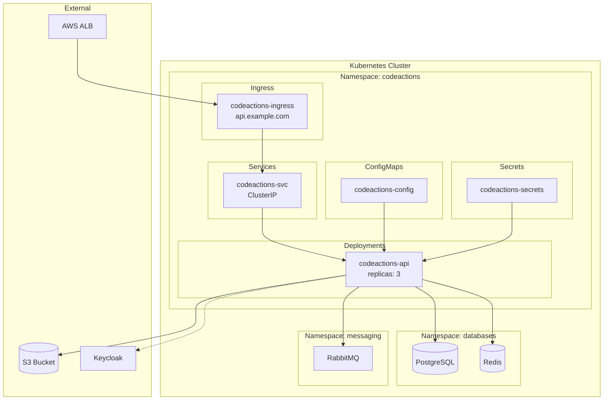
